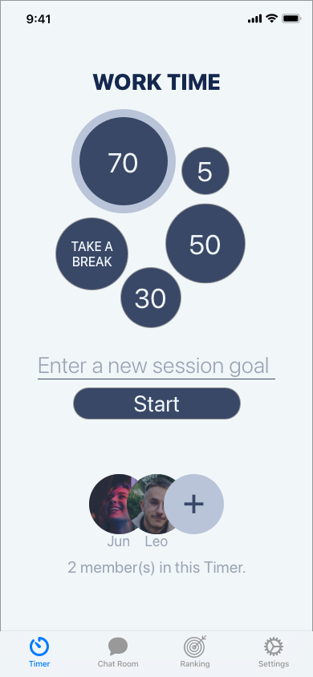
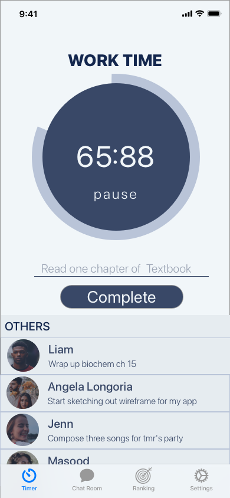

# TimeShare

TimeShare is an app where friends can share a pomodoro timer to work and take breaks together . Before starting a session, each person will be asked to enter a session goal so we can hold each other accountable during work. During a session, you can see each other’s goals as a way to hold each other accountable. 


# Concepts




# Set Up

1. Go to the project root folder
2. Open a terminal at this folder path
3. enter `pod init`
4. Open `TimeShare.xcworkspace` in the folder
5. Build / Run the app

# Branch Color

- F1F6F9   Brand Color 1 Catskill White
- E6ECF0   Brand Color 2 Mystic
- B9C4D8   Brand Color 3 Casper
- 9BA4B4   Brand Color 4 Gull Gray
- 394867   Brand Color 5 Fiord
- 14274E   Brand Color 6 Blue Zodiac

# Other info

- Our app support iOS 13+

- Since Apple has dropped support for iOS8 while CocoaPods had not, we added this code to the Podfile to remove deployment targets from the all the pods in the project and allow them to inherit the proejct /workspace deployment target that has been specified at the top of the Podfile. Info: https://stackoverflow.com/a/64048124

```basic
post_install do |installer|
  installer.pods_project.targets.each do |target|
    target.build_configurations.each do |config|
    config.build_settings.delete 'IPHONEOS_DEPLOYMENT_TARGET'
    end
  end
end
```


